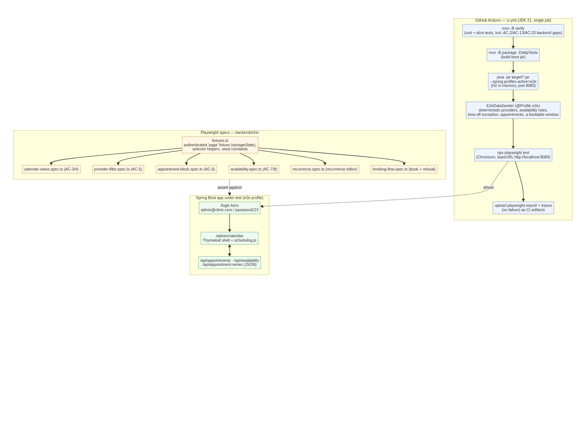

# S-9 — Playwright e2e harness: design & trade-offs

**Status:** design accepted (Ivy, Staff Eng) · **Ticket:** S-9 · **Branch:** `feature/S-9-e2e-playwright`
**Grounded in:** the delivered S-5 UI (`templates/admin/calendar.html`, `static/js/scheduling.js`), the S-4 JSON API (`controller/api/*ApiController.java`), `SecurityConfig`, `DataInitializer`, `pom.xml`, `.github/workflows/ci.yml`, and `design-docs/stories/S-6-acceptance-criteria-traceability.md`.

This document sets the pattern the engineers follow to build the S-9 suite. It does **not** change feature behaviour — S-9 is test coverage only. Where a decision is load-bearing, the trade-off I accepted is stated inline.

---

## 1. The problem, precisely

S-6 verified scheduling at service/persistence/API (green CI, 34 tests) and **deferred the browser-rendered surface** because no e2e harness existed. Deferred to S-9: AC-3, AC-4, AC-5, AC-6, and the DOM/navigation halves of AC-7/AC-8; plus the recurrence-editor and booking flows end to end; plus three backend gaps (AC-2, AC-13, AC-20) that pair with the UI work.

Two constraints shape everything below, both read from the repo rather than assumed:

- **The app has no local run profile.** `HealthcarecrmApplication` loads `.env` via `dotenv-java` and the default datasource points at MySQL RDS. There is no committed way to boot the app without external secrets. An e2e harness must bring its own boot profile.
- **The S-5 UI carries no test hooks.** `calendar.html` and `scheduling.js` address elements by DOM `id` (`#providerSelect`, `#btnPrev`, `#viewWeek`, `#apptForm`, `#recurEditor`, …) and BEM classes (`.sch-event`, `.sch-grid__slot`, `.sch-avail`). There is not a single `data-testid`. The selector convention is a decision we have to make, not one we inherit.

---

## 2. Decisions

### 2.1 Test runner — Playwright, Chromium only
The story names Playwright and Chromium is the browser available in the sandbox. Specs and config live under `backend/e2e/` (a self-contained Node project with its own `package.json`), so the Java build tree is untouched and `mvn` never sees Node.

**Trade-off:** a second toolchain (Node) enters a Maven repo. Accepted because the alternative — a JVM browser driver (Selenium/Selenide) bolted into `mvn verify` — is heavier to maintain, slower, and not what the story asked for. We isolate the cost by keeping e2e in its own directory with its own lockfile, and wire it as a **separate CI step**, not a Maven module.

### 2.2 How e2e boots the app — a dedicated `e2e` Spring profile over H2
Add `src/test/resources/application-e2e.properties` **and** promote the H2 driver so it is available at runtime under this profile (see §5 for the scope note). The profile mirrors the proven S-6 test datasource (H2 in MySQL mode, `ddl-auto=create-drop`) and needs **no secrets**, so `dotenv.ignoreIfMissing()` lets the jar boot with no `.env` present.

CI runs the packaged jar, not `spring-boot:run` or a dev server:
```
java -jar target/*.jar --spring.profiles.active=e2e
```
Playwright's `webServer` block owns this process and waits on `http://localhost:8080/login` before running specs.

**Trade-off:** H2-in-MySQL-mode is not byte-identical to RDS MySQL. Accepted: S-6 already proves the scheduling logic on this exact H2 config (34 green tests), the e2e layer asserts **rendering and navigation**, not SQL dialect edges, and using H2 keeps CI hermetic with no service container. If a dialect gap ever bites, the fallback is a Testcontainers MySQL profile — noted, not built (YAGNI).

### 2.3 Test data — a deterministic `E2eDataSeeder` bean, `@Profile("e2e")`
`DataInitializer` seeds users but **no availability rules, no time-off, no appointments**, and the calendar is empty without them. E2e must not depend on hand-clicking data into existence. Add one seeder, active only under the `e2e` profile, that establishes a **fixed, documented fixture** the specs treat as a contract:

- **Providers:** `Dr. Alice Adams` and `Dr. Bob Barnes` (both `bookableProvider=true`), plus one non-provider employee to prove the filter excludes them.
- **Working hours (AC-7):** Alice Mon–Fri 09:00–17:00; Bob Mon–Fri 10:00–14:00 — so "outside hours" is visibly different per provider.
- **Time-off exception (AC-8):** Alice unavailable on **the seed's anchor Wednesday** 09:00–17:00, so a normally-available block disappears on exactly that date.
- **Appointments (AC-3/4/6):** at least one 30-min and one 90-min appointment on the anchor day for Alice (proves start-position and duration-sizing differ), one for Bob (proves the filter), each with a known customer, status, and a resolvable edit link.
- **A guaranteed-bookable window and a guaranteed-conflict** (AC + booking flow): an open slot inside Alice's hours, and an existing appointment whose time a refusal test targets.

**Anchoring time is the subtle part.** Absolute dates rot. The seeder computes everything relative to a fixed anchor — **the Monday of the current ISO week** — and exposes those dates. Specs read the same anchor (see §3.3) rather than hard-coding `2026-..`. This keeps the suite green every week without editing.

**Trade-off:** the seeder is production code (`src/main`, guarded by `@Profile("e2e")`) rather than a test artifact, because the packaged jar must carry it. Accepted; it is inert outside the `e2e` profile and costs nothing in prod. Keep it in a clearly named `config/e2e/` package so it reads as test scaffolding.

### 2.4 Selector convention — add `data-testid` to the S-5 UI, minimally
Driving off incidental `id`s and BEM classes couples every spec to styling and markup that can change for visual reasons. We add **stable `data-testid` hooks** to the handful of elements the specs assert on, and specs address **only** those. This is the one place S-9 touches `src/main` UI, and it is additive (attributes only — no behaviour, no layout change).

Convention: `data-testid="<area>-<thing>"`, kebab-case. The required set (engineers add exactly these, no more):

| Area | testid | On |
|------|--------|-----|
| Toolbar | `toolbar-provider-select` | provider `<select>` |
| Toolbar | `toolbar-prev` / `toolbar-next` / `toolbar-today` | nav buttons |
| Toolbar | `toolbar-view-day` / `toolbar-view-week` | view toggles |
| Toolbar | `toolbar-range-title` | the range label |
| Toolbar | `toolbar-new-appointment` | "New" button |
| Grid | `calendar-grid` | grid container (carries `data-view="day|week"`) |
| Grid | `calendar-day-column` | each day column (carries `data-date`) |
| Event | `appointment-block` | each `.sch-event` (carries `data-appointment-id`, `data-status`) |
| Event | `appointment-edit-link` | the edit link inside the block/popover |
| Availability | `availability-band` | each `.sch-avail` (carries `data-kind="available|unavailable|exception"`) |
| Booking modal | `appointment-form`, `field-customer`, `field-provider`, `field-start`, `field-end`, `field-status`, `appointment-submit`, `appointment-error` | form + fields + submit + error region |
| Recurrence | `recurrence-toggle`, `recurrence-editor`, `recurrence-day-<dow>`, `recurrence-frequency`, `recurrence-until` | modal controls |

`scheduling.js` builds events and bands in JS — the testids on those are added **in the JS builders**, not the template. Positional assertions (AC-3/4) read the inline `top`/`height` the JS already sets; specs assert *ordering and relative size/offset*, not exact pixels, so they survive CSS tweaks.

**Trade-off:** touching S-5 markup at all. Accepted over the alternative (brittle CSS-selector coupling) because testids are the smallest possible, intention-revealing change and decouple tests from presentation — which is the entire point of the deferred "rendering" verification.

### 2.5 Authentication — real form login, once, via storageState
`SecurityConfig` uses form login with a session cookie; `/api/**` is CSRF-exempt but `/login` is not. Rather than each spec logging in, a Playwright **global setup** logs in through the real form once (`admin@clinic.com` / `password123`, seeded by `DataInitializer`) and saves `storageState`. The authenticated `page` fixture loads that state. This exercises the real auth path once and keeps specs fast.

**Trade-off:** none material; this is the standard Playwright pattern.

### 2.6 Where specs live & the layout engineers follow
```
backend/e2e/
  package.json            # playwright only; not part of mvn
  playwright.config.ts    # chromium project, baseURL, webServer (java -jar), reporters
  global-setup.ts         # form login -> storageState.json
  fixtures.ts             # authed page fixture, seed constants, selector + date helpers
  specs/
    calendar-views.spec.ts      # AC-3/4
    provider-filter.spec.ts     # AC-5
    appointment-block.spec.ts   # AC-6
    availability.spec.ts        # AC-7/8
    recurrence.spec.ts          # recurrence editor
    booking-flow.spec.ts        # book + refusal
```
Backend-gap tests (AC-2/13/20) are **JUnit**, not Playwright — they belong in `src/test/java` alongside the S-6 suite and run in `mvn verify`. Keeping them there (not in e2e) means they gate every PR without needing the browser.

### 2.7 CI wiring
Extend the existing single-job `ci.yml` (do not add a parallel workflow — keep one place to read status):
1. `actions/setup-java@v4` (temurin 21) → `./mvnw -B verify` — includes the three backend-gap tests.
2. `actions/setup-node@v4` (Node 20) → `cd backend/e2e && npm ci && npx playwright install --with-deps chromium`.
3. `./mvnw -B -DskipTests package` → `npx playwright test` (config's `webServer` boots the jar on the `e2e` profile).
4. On failure, `actions/upload-artifact` the `playwright-report/` and traces.

**Trade-off:** CI gets slower (a package + browser run). Accepted — it is the cost of actually verifying the rendered surface, and it runs after the fast unit gate so a compile/logic break fails early and cheap.

---

## 3. Contracts the engineers code against

### 3.1 API shapes (already delivered — specs read these, don't change them)
- `GET /api/appointments?from&to&providerId` → list; `POST /api/appointments` → 201 or 409 on overlap/outside-availability with a message body; `GET/PUT/DELETE /api/appointments/{id}`.
- `GET /api/availability?providerId&from&to` → availability + exceptions for the range.
- `POST /api/appointment-series` → creates a series and its occurrences.

### 3.2 The refusal path (booking flow AC)
A `POST` outside availability or overlapping an existing appointment returns a non-2xx with a message; `scheduling.js` surfaces it in `appointment-error`. The spec asserts the message is **visible** and that a follow-up `GET` shows **nothing new persisted** — refusal must not leak a row.

### 3.3 Seed contract exposed to specs
`E2eDataSeeder` computes dates from `Monday of the current ISO week`. `fixtures.ts` recomputes the same anchor in TS (single helper) so specs never hard-code a calendar date. Provider names, hours, the Wednesday time-off, and the known appointments in §2.3 are the fixture the specs assert against.

---

## 4. Per-criterion mapping (what proves each AC)

| AC / flow | Spec | What it asserts |
|-----------|------|-----------------|
| AC-3/4 | `calendar-views` | day & week views show seeded appts in the right `data-date` column; 90-min block is 3× the 30-min block's height and later one is lower; prev/next/today move `toolbar-range-title` and the visible range |
| AC-5 | `provider-filter` | select Alice → only Alice's blocks+bands; all-providers → both; non-provider never appears |
| AC-6 | `appointment-block` | a block shows customer/provider/time/status text and `appointment-edit-link` navigates to the edit form for that `data-appointment-id` |
| AC-7/8 | `availability` | inside hours → `availability-band[data-kind=available]`, outside → `unavailable`; on the anchor Wednesday Alice's available band is gone (exception), present on other days |
| Recurrence | `recurrence` | open editor, pick days/frequency/until, submit → series occurrences appear on the calendar across the range |
| Booking | `booking-flow` | admin fills `appointment-form` in an open slot → block appears; a conflicting/outside submit → `appointment-error` visible and no new block/row |
| AC-2 | JUnit (`src/test/java`) | `POST` valid → 201; `GET /{id}` round-trips start/end |
| AC-13 | JUnit (`@WebMvcTest` render) | the four read-site templates (`admin/tasks`, `admin/followup`, `admin/addTask`, `employee`) render with no unresolved `dueDate` |
| AC-20 | JUnit | `/v3/api-docs` documents the appointment/availability endpoints and the start/end fields |
| CI | `ci.yml` | the e2e suite runs green alongside `mvnw verify` |

> **AC-2 endpoint note for the implementer:** the traceability doc phrases this as `POST /api/tasks`, but the delivered controller is `POST /api/appointments`. Assert against `/api/appointments` (the appointment round-trip is the substance of AC-2 post-migration); if a `TaskApiController` round-trip is also wanted, add it — but confirm the intent on the card first rather than guessing.

---

## 5. Scope, blast radius, rollback

- **Touches `src/main`:** (a) `data-testid` attributes in `calendar.html` + `scheduling.js` — additive, no behaviour; (b) `E2eDataSeeder` guarded by `@Profile("e2e")` — inert in prod; (c) H2 promoted so the `e2e` profile can boot the jar. H2 is currently `test`-scoped — do **not** widen it to compile scope for prod. Options, in order of preference: keep H2 test-scoped and run e2e via `mvn spring-boot:run -Pe2e` with a test-classpath profile, **or** add a Maven `e2e` profile that includes H2 at runtime only. The implementer picks one and records it; the constraint is *H2 must never ship in the prod artifact*.
- **New code:** `backend/e2e/**` (Node, isolated), `src/test/resources/application-e2e.properties`, three JUnit tests, CI steps, this doc + diagram.
- **Rollback:** revert the branch. The testids and seeder are inert without the `e2e` profile, so even a partial revert leaves prod behaviour unchanged.
- **Out of scope:** re-verifying already-green ACs, any feature/behaviour change, Testcontainers, cross-browser (Chromium only), visual/screenshot diffing.

## 6. Verification reality (stated honestly)
The sandbox has Node + Python but **no JDK**, so I could not compile or boot the Spring app here to smoke-test the `e2e` profile. The boot path is not a guess: it reuses the H2 datasource that S-6's 34 tests already run green in CI on this repo, and `dotenv.ignoreIfMissing()` is confirmed in `HealthcarecrmApplication`. The proof obligation is the **green e2e step in CI** — the implementer must land that, not a local run.

---

## Diagram


Source: `S-9-e2e-flow.mmd`.
